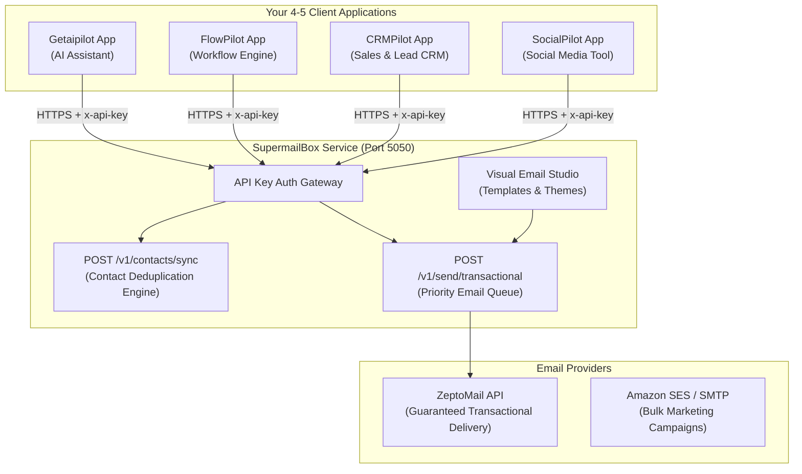

# Multi-Project CPaaS Integration Blueprint: Connecting All Your Projects to SupermailBox

This blueprint explains how to connect your **4–5 individual projects** (`Getaipilot`, `FlowPilot`, `CRMPilot`, `SocialPilot`, etc.) to **SupermailBox** so that all emails (Welcome emails, OTPs, Payment Receipts, Marketing Broadcasts) are managed centrally.

---

## 1. Core Architecture Concept



### Key Principle:
- **Your 4–5 projects DO NOT store email templates, ZeptoMail keys, or SMTP passwords.**
- Instead, each project simply notifies **SupermailBox** when an event happens (e.g., *"User Aarav paid ₹2,499"* or *"User requested OTP 849201"*).
- SupermailBox automatically loads the right template, fills in the variables, checks suppression lists, and delivers the email.

---

## 2. What Code to Build Inside Each of Your 4–5 Projects

In every project you own (`Getaipilot`, `FlowPilot`, etc.), create **one single helper utility file**:  
`src/services/supermailbox.ts` (or `src/lib/emailClient.ts`).

### Exact Copy-Paste Code for `src/services/supermailbox.ts`:

```typescript
// ============================================================================
// SupermailBox CPaaS Client SDK
// Drop this file into any of your 4-5 projects to manage all outbound emails.
// ============================================================================

export interface SupermailboxUser {
  id: string;
  email: string;
  fullName?: string;
  phone?: string;
  attributes?: Record<string, any>;
}

export interface SendEmailRequest {
  to: string;
  templateKey: string;
  idempotencyKey?: string;
  variables?: Record<string, any>;
}

export class SupermailboxClient {
  private baseUrl: string;
  private apiKey: string;

  constructor(apiKey?: string, baseUrl: string = 'http://localhost:5050') {
    this.apiKey = apiKey || process.env.SUPERMAILBOX_API_KEY || '';
    this.baseUrl = baseUrl;
  }

  /**
   * 1. Synchronize user profile with SupermailBox central contact repository.
   * Call this on User Signup or Profile Update.
   */
  async syncUser(user: SupermailboxUser): Promise<{ success: boolean; contactId?: string }> {
    try {
      const response = await fetch(`${this.baseUrl}/v1/contacts/sync`, {
        method: 'POST',
        headers: {
          'Content-Type': 'application/json',
          'x-api-key': this.apiKey
        },
        body: JSON.stringify({
          productUserId: user.id,
          email: user.email,
          fullName: user.fullName,
          phone: user.phone,
          attributes: user.attributes
        })
      });
      return await response.json();
    } catch (error) {
      console.error('[SupermailBox SDK] Contact sync failed:', error);
      return { success: false };
    }
  }

  /**
   * 2. Dispatch a high-priority transactional email (Payment receipt, OTP, Welcome).
   */
  async sendEmail(request: SendEmailRequest): Promise<{ success: boolean; jobId?: string }> {
    try {
      const response = await fetch(`${this.baseUrl}/v1/send/transactional`, {
        method: 'POST',
        headers: {
          'Content-Type': 'application/json',
          'x-api-key': this.apiKey
        },
        body: JSON.stringify({
          to: request.to,
          templateKey: request.templateKey,
          idempotencyKey: request.idempotencyKey || `tx_${Date.now()}_${Math.random()}`,
          variables: request.variables || {}
        })
      });
      return await response.json();
    } catch (error) {
      console.error('[SupermailBox SDK] Send email failed:', error);
      return { success: false };
    }
  }
}

// Singleton export initialized with environment secrets
export const supermailbox = new SupermailboxClient();
```

---

## 3. How Your Projects Use It (Real-World Event Examples)

### Scenario A: When a User Pays in ANY Project (Payment Webhook)
When a customer pays for a subscription in **Getaipilot** or **FlowPilot**, inside your payment webhook controller:

```typescript
import { supermailbox } from '../services/supermailbox';

// Example: Razorpay or Stripe Webhook Route
export async function handlePaymentSuccessWebhook(req, res) {
  const { customer_email, customer_name, amount, invoice_id } = req.body;

  // 1. Send Payment Receipt via SupermailBox
  await supermailbox.sendEmail({
    to: customer_email,
    templateKey: 'payment_receipt', // Uses the sleek emerald invoice template
    idempotencyKey: `pay_${invoice_id}`, // Guarantees customer won't get duplicate emails
    variables: {
      name: customer_name,
      amount: `₹${amount}`,
      invoice_id: invoice_id
    }
  });

  return res.status(200).json({ status: 'Payment receipt sent via SupermailBox' });
}
```

---

### Scenario B: When a User Signs Up in ANY Project (Auth Registration)
When a user registers an account in one of your apps:

```typescript
import { supermailbox } from '../services/supermailbox';

export async function handleUserSignup(newUser: { id: string; email: string; name: string }) {
  // 1. Sync identity into SupermailBox central contact directory
  await supermailbox.syncUser({
    id: newUser.id,
    email: newUser.email,
    fullName: newUser.name,
    attributes: { plan: 'free', signup_app: 'FlowPilot' }
  });

  // 2. Send Welcome Email
  await supermailbox.sendEmail({
    to: newUser.email,
    templateKey: 'auth_welcome',
    variables: {
      name: newUser.name,
      otp_code: '123-456' // Or verification link
    }
  });
}
```

---

## 4. Template & Event Mapping Summary

| Event Occurring in Your Project | Template Key to Use | Required Variables | SupermailBox Behavior |
| :--- | :--- | :--- | :--- |
| **New User Registration** | `auth_welcome` | `name`, `otp_code` | Renders sleek Indigo Welcome card with monospace OTP security box. |
| **Successful Payment / Invoice** | `payment_receipt` | `name`, `amount`, `invoice_id` | Renders Emerald Payment card with itemized invoice summary table. |
| **Product Feature Release** | `feature_announce` | `name` | Renders Purple Announcement card with call-to-action button. |
| **Custom Event / Alert** | Any custom template key | Any custom variables | Dynamically replaces `{{variable}}` inside the visual template. |

---

## 5. Summary Checklist for Each Project
1. Copy `src/services/supermailbox.ts` into each project.
2. Add `SUPERMAILBOX_API_KEY=<your_key>` in that project's `.env`.
3. Call `supermailbox.sendEmail({ to, templateKey, variables })` whenever an event occurs!
